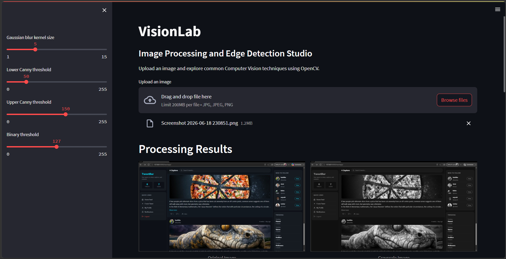
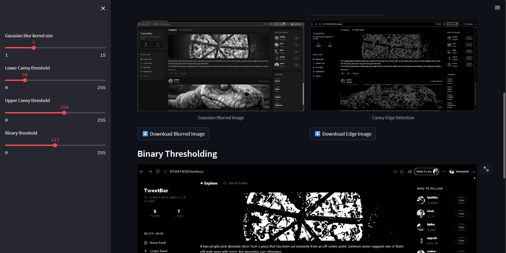

# VisionLab: Image Processing and Edge Detection Studio

## 1. Project Overview

VisionLab is an interactive image-processing application developed using Python, OpenCV, NumPy, Pillow, and Streamlit.

The project allows users to upload an image and apply different image-processing techniques. It provides a simple interface for viewing the original image, processed images, and image statistics.

The main purpose of this project is to demonstrate basic image-processing and edge-detection operations in an easy-to-use application.

## 2. Features

- Upload an image through the Streamlit interface
- Display the original image
- Convert an image into grayscale
- Apply Gaussian blur for noise reduction
- Detect edges using the Canny Edge Detection algorithm
- Apply binary thresholding
- Display basic image statistics
- Download processed images
- Interactive and user-friendly interface

## 3. Technologies and Tools Used

- **Python** – Main programming language
- **OpenCV** – Image processing and edge detection
- **NumPy** – Numerical and array operations
- **Pillow** – Image handling
- **Streamlit** – Web-based interactive user interface
- **Git and GitHub** – Version control and project hosting
- **Visual Studio Code** – Development environment

## 4. Project Structure

```text
VisionLab/
│
├── app.py
├── analysis.py
├── edge_detection.py
├── preprocessing.py
├── requirements.txt
├── README.md
├── statement.md
├── .gitignore
└── venv/

5. Installation and Setup
Step 1: Clone the Repository
git clone https://github.com/Kashikaaaa/VisionLab-Image-Processing.git
Step 2: Open the Project Directory
cd VisionLab-Image-Processing
Step 3: Create a Virtual Environment
python -m venv venv
Step 4: Activate the Virtual Environment
For Windows:
venv\Scripts\activate
Step 5: Install Required Packages
pip install -r requirements.txt

6. Running the Project

Run the following command:

streamlit run app.py

The application will open in a web browser.

7. Instructions for Testing

Start the application using the command given above.

Upload a valid image file.

Check whether the original image is displayed correctly.

Verify the grayscale image output.

Verify that Gaussian blur is applied.

Check whether edges are detected using Canny Edge Detection.

Verify the binary threshold output.

Check the displayed image statistics.

Click the download buttons and verify that processed images can be downloaded.

Test the application with different image sizes and image types.

8. Expected Result

After uploading an image, the application should display the original image and different processed versions of it. The user should also be able to view image statistics and download the processed images.

## 9. Screenshots

### Main Application Interface



### Image Processing Results


